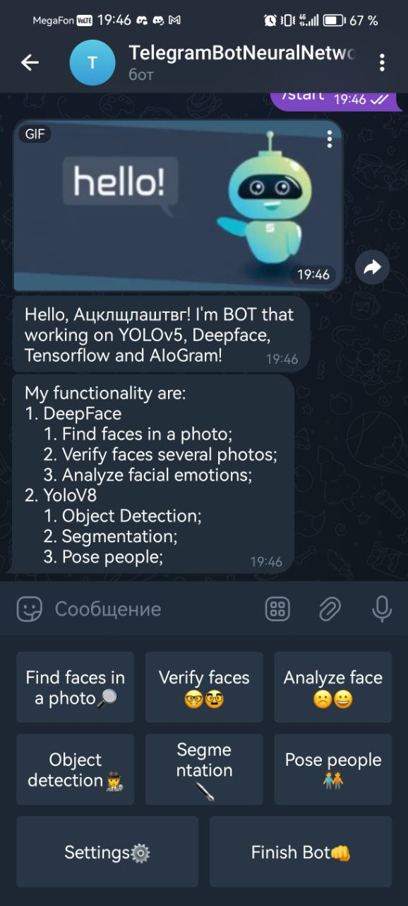
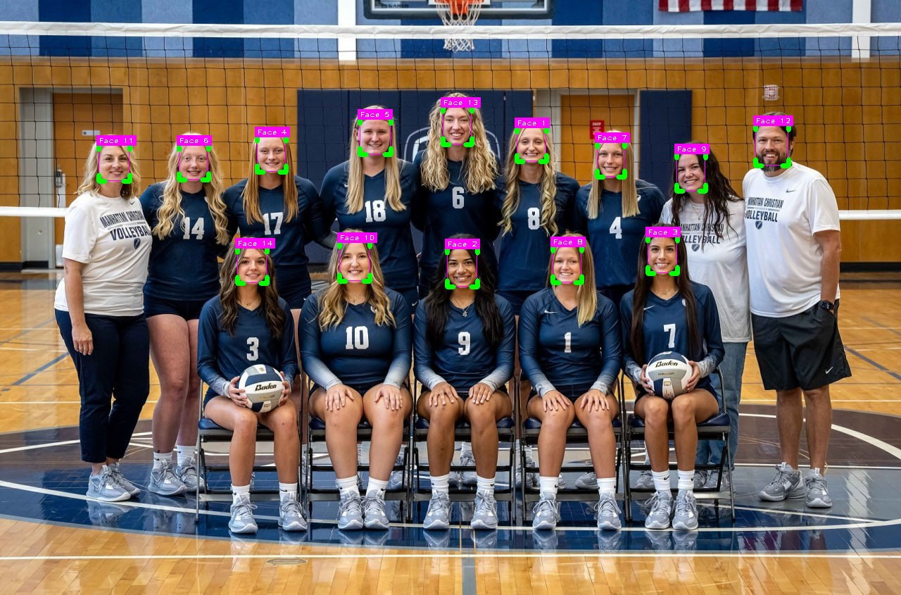

<h1 align="center">Telegram Bot on <a href="https://github.com/serengil/deepface" target="_blank"><u><b>DeepFace</b></u></a> and <a href="https://github.com/ultralytics/ultralytics"><u><b>Ultralytics</b></u></a>🤖</h1>

<h3 align="center">Telegram Bot working with classification, object_detection, segmentation and analizing faces</h3>


The bot provides an opportunity to work with people's faces through a neural network using the libraries YOLOv8, TensorFlow, Keras, Deepface, OpenCV2. Recognition accuracy each model are ~97%.

The functions of this bot:
1. Deepface
   1. Find faces in a photo.
   2. Verify faces in photos.
   3. Analyze facial emotions, gender, race, age.
2. YoloV8
   1. Object detection (persons, animals, cars, food, etc...)
   2. Segmentation (persons, animals, cars, food, etc...)
   3. Pose people (only in aiogram)

The bot will be controlled using telegram and buttons.


# Installation (Windows/Linus/Mac) with <a href="https://github.com/aiogram/aiogram"><u><b>aiogram</b></u></a> or <a href="https://github.com/eternnoir/pyTelegramBotAPI"><u><b>pyTelegramBotApi</b></u></a>
```shell
$ git clone https://github.com/CsgoBotTG/DeepFaceTelegramBot.git
$ cd deepface/aiogram # or cd deepface/pyTelegramBotApi
$ python installing_requirments.py
```

# Usage (Windows/Linus/Mac)
```shell
# base token
$ python main.py
# if you have your own token
$ python main.py -token YOURTOKEN
```


# Examples
### Bot start message
 
___
## DeepFace
### Find Faces


### Verify Faces


_____


```json
{
  "verified": true,
  "distance": 0.5168347646348534,
  "threshold": 0.68,
  "model": "VGG-Face",
  "detector_backend": "opencv",
  "similarity_metric": "cosine",
  "facial_areas": {
    "img1": {
      "x": 124,
      "y": 66,
      "w": 76,
      "h": 76,
      "left_eye": null,
      "right_eye": null
    },
    "img2": {
      "x": 41,
      "y": 69,
      "w": 129,
      "h": 129,
      "left_eye": [
        41,
        51
      ],
      "right_eye": [
        85,
        51
      ]
    }
  },
  "time": 2.03
}
```
______
### Analyze Face


```json
{
  "age": 30,
  "region": {
    "x": 14,
    "y": 104,
    "w": 209,
    "h": 209,
    "left_eye": [
      59,
      84
    ],
    "right_eye": [
      139,
      82
    ]
  },
  "face_confidence": 0.94,
  "gender": {
    "Woman": 99.99415874481201,
    "Man": 0.00583783803449478
  },
  "dominant_gender": "Woman",
  "race": {
    "asian": 8.235586434602737,
    "indian": 8.159320801496506,
    "black": 2.175460383296013,
    "white": 34.432581067085266,
    "middle eastern": 19.77563500404358,
    "latino hispanic": 27.221420407295227
  },
  "dominant_race": "white",
  "emotion": {
    "angry": 0.07972655371297047,
    "disgust": 1.850535874203559e-05,
    "fear": 2.5238615675403557,
    "happy": 0.12739429139203326,
    "sad": 9.245743214576628,
    "surprise": 0.0018270120922080687,
    "neutral": 88.02143192546748
  },
  "dominant_emotion": "neutral"
}
```
## YoloV8
### Object detection


### Segmentation


